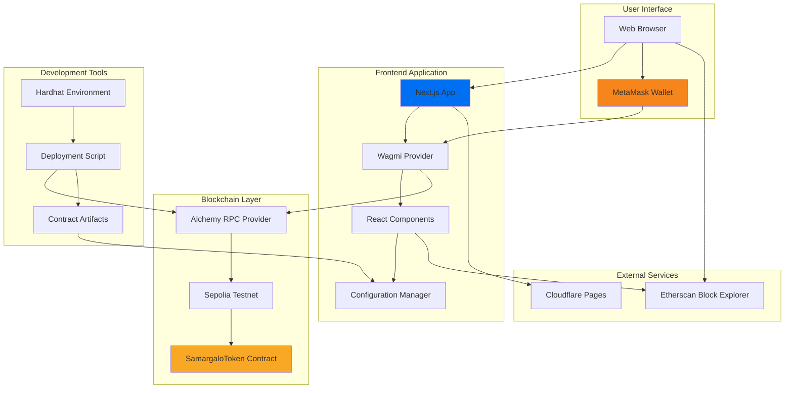
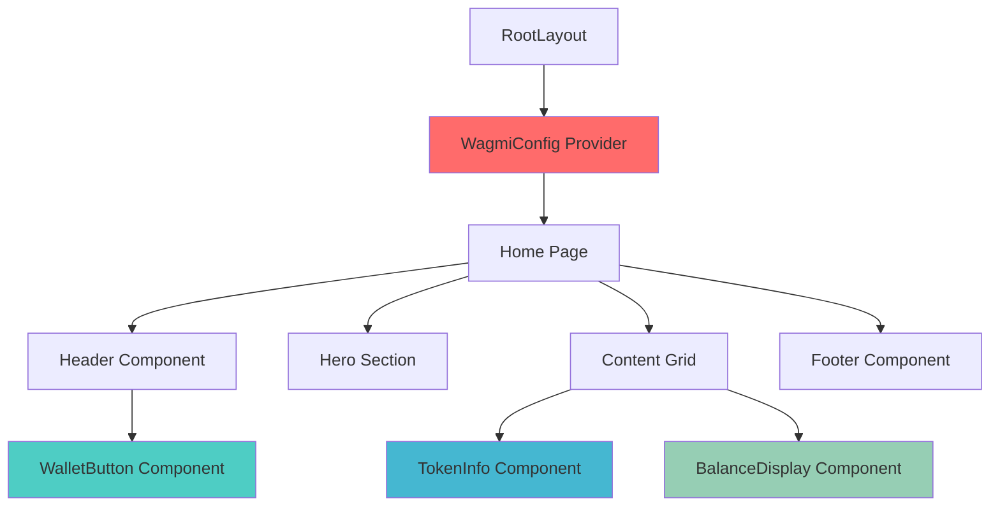

# Design Document: ERC-20 Token Platform

## Overview

The ERC-20 Token Platform is a full-stack decentralized application consisting of two primary subsystems:

1. **Smart Contract System**: A Hardhat-based Solidity development environment for deploying an ERC-20 compliant token (SamargaloToken) to the Sepolia testnet
2. **Frontend Application**: A Next.js 14+ web application with Wagmi v2+ integration for wallet connection, token information display, and real-time balance tracking

The platform enables users to deploy a standard ERC-20 token with a fixed supply of 1,000,000 tokens and interact with it through a modern, responsive web interface. The smart contract leverages OpenZeppelin's battle-tested ERC-20 implementation for security and reliability. The frontend provides seamless MetaMask integration and real-time blockchain data synchronization.

### Key Objectives

- Deploy a secure, auditable ERC-20 token contract to Sepolia testnet
- Provide an intuitive user interface for viewing token information and balances
- Enable wallet connection with MetaMask through Wagmi v2+
- Support real-time balance updates as blockchain state changes
- Ensure responsive design for desktop and mobile devices
- Facilitate blockchain verification through Etherscan integration
- Maintain secure configuration management for deployment credentials

### Technology Stack

**Smart Contract Layer:**
- Solidity 0.8.20
- OpenZeppelin Contracts (ERC-20 implementation)
- Hardhat (development environment, testing, deployment)
- Alchemy (RPC provider for Sepolia network)

**Frontend Layer:**
- Next.js 14+ (App Router)
- TypeScript (type safety)
- Wagmi v2+ (Web3 React hooks)
- Tailwind CSS v4 (styling)
- Cloudflare Pages (static hosting)


## Architecture

### System Architecture Diagram



### High-Level Architecture

The platform follows a three-tier architecture:

1. **Blockchain Layer**: Ethereum Sepolia testnet hosts the SamargaloToken smart contract, accessed via Alchemy RPC provider
2. **Application Layer**: Next.js frontend application with Wagmi integration for Web3 functionality
3. **Presentation Layer**: React components rendering token information and managing user interactions

**Data Flow:**
- User connects wallet → MetaMask prompts → Wagmi stores connection state
- User views balance → Wagmi queries contract → Balance displays in UI
- Blockchain updates → Wagmi detects block → UI automatically refreshes
- User clicks Etherscan link → Opens external verification page

### Smart Contract Architecture

The smart contract system consists of a single, focused contract leveraging OpenZeppelin's ERC-20 implementation:

**SamargaloToken Contract:**
- Inherits OpenZeppelin's ERC20 base contract
- Mints fixed supply (1,000,000 tokens with 18 decimals) to deployer on construction
- No additional minting capabilities (fixed supply model)
- Standard ERC-20 interface for transfers, approvals, and balance queries

**Hardhat Project Structure:**
```
contracts/
├── contracts/
│   └── SamargaloToken.sol          # ERC-20 token implementation
├── scripts/
│   └── deploy.js              # Deployment script
├── hardhat.config.js          # Hardhat configuration
├── package.json               # Dependencies
└── .env                       # Environment variables (gitignored)
```


### Frontend Architecture

The frontend follows Next.js 14+ App Router conventions with a component-based architecture:

**Component Hierarchy:**


**Directory Structure:**
```
frontend/
├── src/
│   ├── app/
│   │   ├── layout.tsx         # Root layout with Wagmi provider
│   │   ├── page.tsx           # Home page
│   │   └── globals.css        # Global styles
│   ├── components/
│   │   ├── Header.tsx         # Header with wallet button
│   │   ├── WalletButton.tsx   # Connect/disconnect wallet
│   │   ├── TokenInfo.tsx      # Token metadata display
│   │   └── BalanceDisplay.tsx # Real-time balance display
│   └── lib/
│       ├── config.ts          # Wagmi configuration
│       └── constants.ts       # Contract address, ABI, network config
├── public/                    # Static assets
├── next.config.js             # Next.js configuration
├── tailwind.config.js         # Tailwind CSS configuration
├── package.json               # Dependencies
└── .env.local                 # Environment variables (gitignored)
```


## Components and Interfaces

### Smart Contract Components

#### SamargaloToken Contract

**Purpose**: ERC-20 compliant token contract with fixed supply minted to deployer.

**Inheritance**: `ERC20` from `@openzeppelin/contracts/token/ERC20/ERC20.sol`

**Constructor Signature:**
```solidity
constructor() ERC20("Samargalo Custom Token", "SCT")
```

**Constructor Behavior:**
1. Calls parent ERC20 constructor with name "Samargalo Custom Token" and symbol "SCT"
2. Mints 1,000,000 tokens (1000000 * 10^18 wei) to `msg.sender` (deployer)

**Inherited Public Interface (ERC-20 Standard):**
```solidity
function name() external view returns (string memory)
function symbol() external view returns (string memory)
function decimals() external view returns (uint8)
function totalSupply() external view returns (uint256)
function balanceOf(address account) external view returns (uint256)
function transfer(address to, uint256 amount) external returns (bool)
function allowance(address owner, address spender) external view returns (uint256)
function approve(address spender, uint256 amount) external returns (bool)
function transferFrom(address from, address to, uint256 amount) external returns (bool)
```

**Events (Inherited):**
```solidity
event Transfer(address indexed from, address indexed to, uint256 value)
event Approval(address indexed owner, address indexed spender, uint256 value)
```

**Compilation Settings:**
- Solidity Version: `0.8.20`
- Optimizer: Enabled with 200 runs
- EVM Version: `paris` (default for 0.8.20)


#### Deployment Script

**Purpose**: Deploy SamargaloToken to Sepolia testnet and save deployment artifacts.

**Interface:**
```javascript
async function main(): Promise<void>
```

**Behavior:**
1. Retrieves deployer account from Hardhat ethers provider
2. Logs deployer address and balance
3. Deploys SamargaloToken contract using `ContractFactory`
4. Waits for deployment transaction to be mined
5. Logs deployment information (contract address, transaction hash, deployer)
6. Saves deployment data to `deployed-address.json` in project root

**Output Artifact Structure:**
```json
{
  "contractAddress": "0x...",
  "deployer": "0x...",
  "transactionHash": "0x...",
  "network": "sepolia",
  "timestamp": "ISO-8601 timestamp"
}
```

**Environment Dependencies:**
- `SEPOLIA_PRIVATE_KEY`: Private key for deployment account
- `ALCHEMY_SEPOLIA_URL`: Alchemy RPC endpoint for Sepolia

#### Hardhat Configuration

**Purpose**: Configure Hardhat environment for Sepolia deployment.

**Network Configuration:**
```javascript
networks: {
  sepolia: {
    url: process.env.ALCHEMY_SEPOLIA_URL,
    accounts: [process.env.SEPOLIA_PRIVATE_KEY],
    chainId: 11155111
  }
}
```

**Compiler Configuration:**
```javascript
solidity: {
  version: "0.8.20",
  settings: {
    optimizer: {
      enabled: true,
      runs: 200
    }
  }
}
```


### Frontend Components

#### WalletButton Component

**Purpose**: Manage wallet connection and display connection status.

**Props**: None

**State Management**: Uses Wagmi hooks for wallet state
- `useAccount()`: Get connected account address
- `useConnect()`: Initiate wallet connection
- `useDisconnect()`: Disconnect wallet

**Component States:**
1. **Disconnected**: Shows "Connect Wallet" button
2. **Connecting**: Shows "Connecting..." with loading indicator
3. **Connected**: Shows truncated address (e.g., "0x1234...5678") with disconnect option
4. **Error**: Shows error message with retry option

**Interface:**
```typescript
function WalletButton(): JSX.Element

// Internal state derived from hooks
type WalletState = {
  address?: `0x${string}`
  isConnecting: boolean
  isConnected: boolean
  error?: Error
}
```

**Behavior:**
- Click when disconnected → Calls `connect()` with MetaMask connector
- Click when connected → Calls `disconnect()`
- Displays truncated address: first 6 chars + "..." + last 4 chars
- Shows loading spinner during connection
- Displays error messages in red with retry button

**Styling Requirements:**
- Primary button style when disconnected
- Secondary button style when connected
- Touch-friendly size (min 44x44px)
- Hover and focus states for accessibility


#### TokenInfo Component

**Purpose**: Display token metadata and provide Etherscan verification link.

**Props**: None (uses constants from configuration)

**Data Sources:**
- `SAMARGALO_TOKEN_ADDRESS` from constants
- `SEPOLIA_ETHERSCAN_BASE_URL` from constants
- Static metadata (name, symbol, description)

**Interface:**
```typescript
function TokenInfo(): JSX.Element

// Uses constants
const TOKEN_METADATA = {
  name: "Samargalo Custom Token",
  symbol: "SCT",
  description: string,
  contractAddress: `0x${string}`
}
```

**Display Elements:**
1. Token name (heading)
2. Token symbol (subheading)
3. Contract address (monospace font, copyable)
4. Description text
5. Etherscan link button ("View on Etherscan")

**Behavior:**
- Etherscan link opens in new tab (`target="_blank"`)
- Contract address is truncated on mobile, full on desktop
- Copy-to-clipboard functionality on address click (optional enhancement)

**Etherscan URL Construction:**
```typescript
const etherscanUrl = `${SEPOLIA_ETHERSCAN_BASE_URL}/address/${SAMARGALO_TOKEN_ADDRESS}`
```

**Styling Requirements:**
- Card-based layout with border and shadow
- Monospace font for contract address
- External link icon on Etherscan button
- Responsive padding and typography


#### BalanceDisplay Component

**Purpose**: Display real-time token balance for connected wallet.

**Props**: None (uses wallet state from Wagmi context)

**State Management**: Uses Wagmi hooks for balance tracking
- `useAccount()`: Get connected wallet address
- `useReadContract()`: Read balance from contract
- `useBlockNumber()`: Track block updates for refresh

**Interface:**
```typescript
function BalanceDisplay(): JSX.Element

// Internal data from hooks
type BalanceData = {
  value?: bigint
  isLoading: boolean
  isError: boolean
  error?: Error
}
```

**Component States:**
1. **No Wallet Connected**: Displays "0 SCT"
2. **Loading**: Shows loading spinner with "Loading balance..."
3. **Success**: Displays formatted balance with "SCT" symbol
4. **Error**: Shows error message and retry option

**Balance Reading:**
```typescript
useReadContract({
  address: SAMARGALO_TOKEN_ADDRESS,
  abi: SAMARGALO_TOKEN_ABI,
  functionName: 'balanceOf',
  args: [connectedAddress],
  watch: true  // Enable automatic refresh on new blocks
})
```

**Balance Formatting:**
- Convert from wei (18 decimals) to human-readable format
- Display 2-4 decimal places based on value size
- Add thousands separators for large values
- Append " SCT" symbol

**Behavior:**
- Automatically refreshes when new blocks are mined
- Automatically refreshes when wallet address changes
- Shows loading state during initial fetch and refreshes
- Displays "0 SCT" as fallback for disconnected state

**Styling Requirements:**
- Large, prominent display of balance value
- Card-based layout matching TokenInfo component
- Loading spinner during fetch
- Error state in red with retry button


#### Header Component

**Purpose**: Application header with title and wallet connection.

**Props**: None

**Interface:**
```typescript
function Header(): JSX.Element
```

**Layout:**
- Full-width container with horizontal flexbox
- Application title on left
- WalletButton component on right
- Sticky positioning (optional) for persistent access

**Responsive Behavior:**
- Desktop: Horizontal layout with space-between
- Mobile: Stack vertically or reduce padding for compact view

**Styling Requirements:**
- Consistent with overall application theme
- Clear visual separation from main content (border-bottom)
- Adequate padding and spacing

#### Page Layout Components

**Home Page (`app/page.tsx`):**

**Structure:**
```tsx
<main>
  <Header />
  <HeroSection />
  <ContentGrid>
    <TokenInfo />
    <BalanceDisplay />
  </ContentGrid>
  <Footer />
</main>
```

**Hero Section:**
- Welcome message/tagline
- Brief description of the platform
- Call-to-action (implicitly: connect wallet to view balance)

**Content Grid:**
- Two-column layout on desktop (≥768px)
- Single-column layout on mobile (<768px)
- Equal-width columns with gap spacing

**Footer:**
- Additional Etherscan links (contract, deployer address)
- Platform information
- External link icons for all outbound links


#### Root Layout Component

**Purpose**: Configure Wagmi provider and global styles.

**Interface:**
```typescript
function RootLayout({ children }: { children: React.ReactNode }): JSX.Element
```

**Structure:**
```tsx
<html>
  <body>
    <WagmiProvider config={wagmiConfig}>
      {children}
    </WagmiProvider>
  </body>
</html>
```

**Responsibilities:**
- Initialize Wagmi configuration
- Apply global CSS
- Set HTML metadata (title, description, viewport)
- Provide Web3 context to all child components

### Configuration Components

#### Constants File (`lib/constants.ts`)

**Purpose**: Centralize contract addresses, ABIs, and network configuration.

**Exports:**
```typescript
// Contract Configuration
export const SAMARGALO_TOKEN_ADDRESS: `0x${string}` = "0x..." as const
export const SAMARGALO_TOKEN_ABI = [...] as const

// Network Configuration
export const SEPOLIA_CHAIN_ID = 11155111
export const SEPOLIA_ETHERSCAN_BASE_URL = "https://sepolia.etherscan.io"

// Token Metadata
export const TOKEN_NAME = "Samargalo Custom Token"
export const TOKEN_SYMBOL = "SCT"
export const TOKEN_DECIMALS = 18
```

**ABI Contents:**
Must include at minimum:
- `balanceOf(address)` function signature
- `name()` function signature
- `symbol()` function signature
- `decimals()` function signature
- `Transfer` event signature (for potential event listening)


#### Wagmi Configuration (`lib/config.ts`)

**Purpose**: Configure Wagmi for Sepolia network with MetaMask support.

**Interface:**
```typescript
import { createConfig, http } from 'wagmi'
import { sepolia } from 'wagmi/chains'
import { metaMask } from 'wagmi/connectors'

export const wagmiConfig = createConfig({
  chains: [sepolia],
  connectors: [metaMask()],
  transports: {
    [sepolia.id]: http(process.env.NEXT_PUBLIC_ALCHEMY_URL || 'https://eth-sepolia.g.alchemy.com/v2/...')
  }
})
```

**Configuration Details:**
- **Chains**: Sepolia testnet only (chain ID 11155111)
- **Connectors**: MetaMask connector for browser extension
- **Transports**: HTTP transport via Alchemy RPC (with public fallback)

**Environment Variables:**
- `NEXT_PUBLIC_ALCHEMY_URL`: Alchemy RPC URL for Sepolia (must be prefixed with `NEXT_PUBLIC_` for browser access)

**Fallback Strategy:**
If `NEXT_PUBLIC_ALCHEMY_URL` is not set, use public Alchemy endpoint as fallback (rate-limited but functional for testing).


## Data Models

### Smart Contract Data Models

#### Token State

The ERC-20 standard maintains the following state variables (inherited from OpenZeppelin ERC20):

```solidity
// Inherited state (internal to OpenZeppelin implementation)
mapping(address => uint256) private _balances
mapping(address => mapping(address => uint256)) private _allowances
uint256 private _totalSupply
string private _name
string private _symbol
```

**SamargaloToken Initial State (Post-Deployment):**
```
_name = "Samargalo Custom Token"
_symbol = "SCT"
_totalSupply = 1000000 * 10^18  // 1 million tokens with 18 decimals
_balances[deployer] = 1000000 * 10^18
_balances[all other addresses] = 0
_allowances[*][*] = 0
```

#### Deployment Artifact Model

**File**: `deployed-address.json`

**Schema:**
```typescript
interface DeploymentArtifact {
  contractAddress: string      // Ethereum address (0x...)
  deployer: string             // Deployer address (0x...)
  transactionHash: string      // Deployment tx hash (0x...)
  network: string              // "sepolia"
  timestamp: string            // ISO-8601 format
}
```

**Example:**
```json
{
  "contractAddress": "0x5FbDB2315678afecb367f032d93F642f64180aa3",
  "deployer": "0xf39Fd6e51aad88F6F4ce6aB8827279cffFb92266",
  "transactionHash": "0x1234567890abcdef...",
  "network": "sepolia",
  "timestamp": "2024-01-15T10:30:00.000Z"
}
```


### Frontend Data Models

#### Wallet Connection State

**Source**: Wagmi `useAccount()` hook

**Type Definition:**
```typescript
interface WalletAccount {
  address?: `0x${string}`      // Connected wallet address
  isConnected: boolean          // Connection status
  isConnecting: boolean         // Connection in progress
  isDisconnected: boolean       // Disconnected status
  connector?: Connector         // Active connector (MetaMask)
  chain?: Chain                 // Connected chain
  status: 'connected' | 'connecting' | 'disconnected' | 'reconnecting'
}
```

#### Token Balance State

**Source**: Wagmi `useReadContract()` hook

**Type Definition:**
```typescript
interface BalanceResult {
  data?: bigint                 // Balance in wei (18 decimals)
  isLoading: boolean            // Fetch in progress
  isError: boolean              // Error occurred
  error?: Error                 // Error details
  isSuccess: boolean            // Successful fetch
  refetch: () => void           // Manual refetch function
}
```

**Balance Conversion:**
```typescript
// Convert wei (bigint) to human-readable format
function formatBalance(balanceWei: bigint, decimals: number = 18): string {
  const divisor = BigInt(10 ** decimals)
  const wholePart = balanceWei / divisor
  const fractionalPart = balanceWei % divisor
  
  // Format to 2-4 decimal places
  const formattedFractional = (fractionalPart / BigInt(10 ** (decimals - 4))).toString().padStart(4, '0')
  return `${wholePart}.${formattedFractional.substring(0, 4)}`
}
```


#### Contract Configuration Model

**Source**: `lib/constants.ts`

**Type Definition:**
```typescript
interface ContractConfig {
  address: `0x${string}`
  abi: readonly unknown[]       // ABI array (const assertion for type safety)
}

interface NetworkConfig {
  chainId: number
  chainName: string
  rpcUrl: string
  blockExplorer: string
}

interface TokenMetadata {
  name: string
  symbol: string
  decimals: number
  description: string
}
```

**Usage in Components:**
```typescript
// Reading balance
const { data: balance } = useReadContract({
  address: SAMARGALO_TOKEN_ADDRESS,
  abi: SAMARGALO_TOKEN_ABI,
  functionName: 'balanceOf',
  args: [walletAddress]
})
```


## Correctness Properties

*A property is a characteristic or behavior that should hold true across all valid executions of a system—essentially, a formal statement about what the system should do. Properties serve as the bridge between human-readable specifications and machine-verifiable correctness guarantees.*

The ERC-20 Token Platform includes several universal properties that should hold across all valid inputs. These properties will be validated through property-based testing using appropriate libraries (Hardhat tests for smart contracts, React Testing Library with fast-check for frontend components).

### Property 1: Transfer Event Emission

*For any* valid token transfer operation (where sender has sufficient balance and recipient is a valid address), the contract SHALL emit a Transfer event with the correct sender, recipient, and amount parameters.

**Validates: Requirements 1.5**

**Testing Strategy**: Generate random valid transfer scenarios (sender addresses with sufficient balance, recipient addresses, transfer amounts) and verify that each transfer operation emits a Transfer event with parameters matching the transaction.

### Property 2: Approval Event Emission

*For any* valid approval operation (where owner and spender are valid addresses), the contract SHALL emit an Approval event with the correct owner, spender, and amount parameters.

**Validates: Requirements 1.6**

**Testing Strategy**: Generate random valid approval scenarios (owner addresses, spender addresses, allowance amounts) and verify that each approve operation emits an Approval event with parameters matching the approval.

### Property 3: Address Truncation Format

*For any* valid Ethereum address (0x followed by 40 hexadecimal characters), the WalletButton component SHALL display the address in truncated format showing the first 6 characters, followed by "...", followed by the last 4 characters (e.g., "0x1234...5678").

**Validates: Requirements 6.7**

**Testing Strategy**: Generate random valid Ethereum addresses and verify that the truncation function produces strings matching the pattern `0x[4 hex chars]...[4 hex chars]` where the hex characters match the input address boundaries.


### Property 4: Balance Formatting Precision

*For any* token balance value (represented as a bigint with 18 decimals), the BalanceDisplay component SHALL format the balance to display 2-4 decimal places with proper decimal point positioning.

**Validates: Requirements 8.2**

**Testing Strategy**: Generate random balance values (ranging from 0 to maximum uint256) and verify that the formatting function produces strings with a decimal point and 2-4 digits after the decimal point, correctly converting from wei (18 decimals) to human-readable format.

### Property 5: Balance Symbol Suffix

*For any* formatted token balance string, the BalanceDisplay component SHALL append the " SCT" symbol suffix to the displayed value.

**Validates: Requirements 8.3**

**Testing Strategy**: Generate random balance values, format them, and verify that the resulting display string ends with " SCT" (space followed by the token symbol).

### Property 6: Etherscan URL Construction

*For any* valid Ethereum address, the application SHALL construct Etherscan URLs following the format `https://sepolia.etherscan.io/address/{address}` where {address} is the full 42-character Ethereum address.

**Validates: Requirements 13.4**

**Testing Strategy**: Generate random valid Ethereum addresses and verify that the URL construction function produces strings matching the pattern `https://sepolia.etherscan.io/address/0x[40 hex chars]` where the hex characters match the input address.


## Error Handling

### Smart Contract Error Handling

**OpenZeppelin ERC-20 Built-in Protection:**

The SamargaloToken contract inherits comprehensive error handling from OpenZeppelin's ERC20 implementation:

1. **Transfer Validation:**
   - Reverts with `ERC20InsufficientBalance` if sender balance is insufficient
   - Reverts with `ERC20InvalidReceiver` if recipient is zero address
   - Reverts with `ERC20InvalidSender` if sender is zero address

2. **Approval Validation:**
   - Reverts with `ERC20InvalidApprover` if approver is zero address
   - Reverts with `ERC20InvalidSpender` if spender is zero address

3. **Arithmetic Safety:**
   - Solidity 0.8.20 provides built-in overflow/underflow protection
   - All arithmetic operations revert on overflow/underflow

**Deployment Script Error Handling:**

```javascript
try {
  // Validate environment variables
  if (!process.env.SEPOLIA_PRIVATE_KEY) {
    throw new Error("SEPOLIA_PRIVATE_KEY not found in environment variables")
  }
  if (!process.env.ALCHEMY_SEPOLIA_URL) {
    throw new Error("ALCHEMY_SEPOLIA_URL not found in environment variables")
  }
  
  // Deploy contract
  const samargaloToken = await ethers.deployContract("SamargaloToken")
  await samargaloToken.waitForDeployment()
  
  // Save deployment info
  const deploymentInfo = {
    contractAddress: await samargaloToken.getAddress(),
    deployer: deployer.address,
    transactionHash: samargaloToken.deploymentTransaction()?.hash,
    network: "sepolia",
    timestamp: new Date().toISOString()
  }
  
  fs.writeFileSync('deployed-address.json', JSON.stringify(deploymentInfo, null, 2))
  
} catch (error) {
  console.error("Deployment failed:", error.message)
  process.exit(1)
}
```

**Error Scenarios:**
- Missing environment variables → Exit with error message
- Insufficient ETH for gas → Network error propagates, script exits
- Network connectivity issues → Timeout error, script exits
- Contract compilation errors → Hardhat catches and displays


### Frontend Error Handling

**Wallet Connection Errors:**

```typescript
// WalletButton component error handling
const { connect, error: connectError } = useConnect()

if (connectError) {
  return (
    <div className="error-container">
      <p className="error-message">
        {connectError.name === 'UserRejectedRequestError' 
          ? 'Connection request rejected. Please try again.'
          : `Connection failed: ${connectError.message}`
        }
      </p>
      <button onClick={() => connect()}>Retry</button>
    </div>
  )
}
```

**Error Types:**
- `UserRejectedRequestError`: User cancelled MetaMask connection prompt
- `ConnectorNotFoundError`: MetaMask not installed
- `ChainMismatchError`: Wallet connected to wrong network
- Generic connection errors: Display error message with retry option

**Balance Reading Errors:**

```typescript
// BalanceDisplay component error handling
const { data: balance, isError, error } = useReadContract({
  address: SAMARGALO_TOKEN_ADDRESS,
  abi: SAMARGALO_TOKEN_ABI,
  functionName: 'balanceOf',
  args: [address]
})

if (isError) {
  return (
    <div className="error-container">
      <p className="error-message">
        Failed to load balance. Please check your connection and try again.
      </p>
      <button onClick={() => refetch()}>Retry</button>
    </div>
  )
}
```

**Error Scenarios:**
- RPC endpoint unreachable → Display connection error, provide retry
- Contract address invalid → Display configuration error
- Wallet disconnected mid-read → Fall back to "0 SCT" display
- Network congestion/timeout → Display timeout error with retry


**Network Mismatch Handling:**

The application should detect when the wallet is connected to a network other than Sepolia:

```typescript
// In Wagmi config or component
const { chain } = useAccount()

if (chain && chain.id !== sepolia.id) {
  return (
    <div className="warning-container">
      <p className="warning-message">
        Please switch to Sepolia testnet in MetaMask
      </p>
      <button onClick={() => switchNetwork({ chainId: sepolia.id })}>
        Switch Network
      </button>
    </div>
  )
}
```

**Graceful Degradation:**
- MetaMask not installed → Display message with installation link
- Wallet connection unavailable → Show token info, balance displays "0 SCT"
- RPC endpoint down → Display error, suggest checking internet connection
- Outdated browser → Display compatibility warning

**User-Friendly Error Messages:**
All error messages should be:
- Clear and actionable (tell user what to do)
- Non-technical (avoid jargon like "RPC", "ABI", "wei")
- Include retry mechanisms where applicable
- Provide links to help resources (MetaMask installation, Sepolia faucets)


## Testing Strategy

### Overview

The ERC-20 Token Platform uses a multi-layered testing approach combining unit tests, integration tests, and property-based tests to ensure comprehensive coverage:

1. **Smart Contract Testing**: Hardhat + Chai for unit and integration tests
2. **Frontend Component Testing**: React Testing Library + Jest for UI component tests
3. **Property-Based Testing**: fast-check (frontend) and Hardhat property tests (contracts) for universal properties
4. **Integration Testing**: End-to-end tests for deployment and wallet interaction

### Smart Contract Testing

**Testing Framework:**
- Hardhat with ethers.js
- Chai assertions
- Hardhat network (local blockchain fork)

**Test Categories:**

1. **Unit Tests - ERC-20 Standard Compliance:**
   ```javascript
   describe("SamargaloToken", function() {
     it("should have correct name", async function() {
       expect(await token.name()).to.equal("Samargalo Custom Token")
     })
     
     it("should have correct symbol", async function() {
       expect(await token.symbol()).to.equal("SCT")
     })
     
     it("should mint 1M tokens to deployer", async function() {
       const deployerBalance = await token.balanceOf(deployer.address)
       expect(deployerBalance).to.equal(ethers.parseEther("1000000"))
     })
   })
   ```

2. **Property-Based Tests - Event Emission:**
   ```javascript
   describe("Transfer Events", function() {
     it("should emit Transfer event for any valid transfer", async function() {
       // Run 100 iterations with random amounts and recipients
       for (let i = 0; i < 100; i++) {
         const amount = randomAmount()
         const recipient = randomAddress()
         
         await expect(token.transfer(recipient, amount))
           .to.emit(token, "Transfer")
           .withArgs(deployer.address, recipient, amount)
       }
     })
   })
   ```


3. **Integration Tests - Deployment:**
   ```javascript
   describe("Deployment", function() {
     it("should deploy to Sepolia testnet", async function() {
       // This test runs against actual Sepolia fork
       const samargaloToken = await ethers.deployContract("SamargaloToken")
       await samargaloToken.waitForDeployment()
       
       const address = await samargaloToken.getAddress()
       expect(address).to.match(/^0x[a-fA-F0-9]{40}$/)
     })
     
     it("should save deployment artifacts", async function() {
       // Verify deployed-address.json is created
       const deploymentInfo = JSON.parse(fs.readFileSync('deployed-address.json'))
       expect(deploymentInfo).to.have.property('contractAddress')
       expect(deploymentInfo).to.have.property('deployer')
       expect(deploymentInfo).to.have.property('transactionHash')
     })
   })
   ```

**Test Coverage Goals:**
- 100% coverage of SamargaloToken contract functions
- All ERC-20 standard functions tested
- Event emission verified for all state changes
- Edge cases: zero address, zero amount, insufficient balance

### Frontend Testing

**Testing Framework:**
- Jest (test runner)
- React Testing Library (component testing)
- @testing-library/user-event (user interaction simulation)
- fast-check (property-based testing)

**Test Categories:**

1. **Component Unit Tests:**
   ```typescript
   describe('WalletButton', () => {
     it('displays "Connect Wallet" when disconnected', () => {
       render(<WalletButton />)
       expect(screen.getByText(/connect wallet/i)).toBeInTheDocument()
     })
     
     it('displays truncated address when connected', () => {
       const mockAddress = '0x1234567890123456789012345678901234567890'
       render(<WalletButton />, { 
         wrapper: ({ children }) => (
           <WagmiProvider config={mockConfig}>
             {children}
           </WagmiProvider>
         )
       })
       expect(screen.getByText(/0x1234...7890/)).toBeInTheDocument()
     })
   })
   ```


2. **Property-Based Tests:**
   ```typescript
   import fc from 'fast-check'
   
   describe('Address Truncation', () => {
     it('truncates any valid address correctly', () => {
       // Feature: erc20-token-platform, Property 3: Address truncation format
       fc.assert(
         fc.property(
           fc.hexaString({ minLength: 40, maxLength: 40 }),
           (hexAddress) => {
             const address = `0x${hexAddress}`
             const truncated = truncateAddress(address)
             
             // Verify format: 0x[4 chars]...[4 chars]
             expect(truncated).toMatch(/^0x[a-fA-F0-9]{4}\.\.\.[a-fA-F0-9]{4}$/)
             
             // Verify correct characters
             expect(truncated).toBe(
               `${address.slice(0, 6)}...${address.slice(-4)}`
             )
           }
         ),
         { numRuns: 100 }
       )
     })
     
     it('formats any balance correctly', () => {
       // Feature: erc20-token-platform, Property 4: Balance formatting precision
       fc.assert(
         fc.property(
           fc.bigUintN(256), // Random bigint up to uint256 max
           (balanceWei) => {
             const formatted = formatBalance(balanceWei, 18)
             
             // Should have decimal point
             expect(formatted).toMatch(/\d+\.\d{2,4}/)
             
             // Should not have more than 4 decimal places
             const decimalPart = formatted.split('.')[1]
             expect(decimalPart.length).toBeGreaterThanOrEqual(2)
             expect(decimalPart.length).toBeLessThanOrEqual(4)
           }
         ),
         { numRuns: 100 }
       )
     })
     
     it('appends SCT symbol to any balance', () => {
       // Feature: erc20-token-platform, Property 5: Balance symbol suffix
       fc.assert(
         fc.property(
           fc.bigUintN(256),
           (balanceWei) => {
             const display = formatBalanceDisplay(balanceWei)
             expect(display).toMatch(/\d+\.\d+ SCT$/)
           }
         ),
         { numRuns: 100 }
       )
     })
   })
   ```


   ```typescript
   describe('Etherscan URL Construction', () => {
     it('constructs correct URL for any valid address', () => {
       // Feature: erc20-token-platform, Property 6: Etherscan URL construction
       fc.assert(
         fc.property(
           fc.hexaString({ minLength: 40, maxLength: 40 }),
           (hexAddress) => {
             const address = `0x${hexAddress}`
             const url = constructEtherscanUrl(address)
             
             expect(url).toBe(
               `https://sepolia.etherscan.io/address/${address}`
             )
           }
         ),
         { numRuns: 100 }
       )
     })
   })
   ```

3. **Integration Tests - Wagmi Hooks:**
   ```typescript
   describe('BalanceDisplay Integration', () => {
     it('fetches balance from contract', async () => {
       const { result } = renderHook(() => useReadContract({
         address: SAMARGALO_TOKEN_ADDRESS,
         abi: SAMARGALO_TOKEN_ABI,
         functionName: 'balanceOf',
         args: [mockAddress]
       }), {
         wrapper: WagmiWrapper
       })
       
       await waitFor(() => expect(result.current.isSuccess).toBe(true))
       expect(result.current.data).toBeDefined()
     })
   })
   ```

**Test Coverage Goals:**
- All components have unit tests
- All utility functions have property-based tests where applicable
- User interactions tested (connect, disconnect, navigation)
- Responsive design tested at mobile and desktop breakpoints
- Error states tested for all async operations


### End-to-End Testing

**Manual Testing Checklist:**

1. **Smart Contract Deployment:**
   - [ ] Deploy to Sepolia using deployment script
   - [ ] Verify deployment artifacts saved correctly
   - [ ] Check deployer balance equals 1M SCT
   - [ ] Verify contract on Sepolia Etherscan
   - [ ] Test transfer function with test accounts
   - [ ] Verify Transfer events on Etherscan

2. **Frontend Wallet Connection:**
   - [ ] Connect MetaMask on Sepolia
   - [ ] Verify address displays correctly (truncated format)
   - [ ] Disconnect and verify UI updates
   - [ ] Test with multiple accounts
   - [ ] Test error case: wrong network
   - [ ] Test error case: MetaMask not installed

3. **Frontend Balance Display:**
   - [ ] View balance with connected wallet
   - [ ] Verify balance format (2-4 decimals, SCT suffix)
   - [ ] Test with account having 0 balance
   - [ ] Test with account having large balance
   - [ ] Perform transfer and verify auto-refresh
   - [ ] Test disconnected state shows "0 SCT"

4. **Frontend UI/UX:**
   - [ ] Test responsive layout on mobile (< 768px)
   - [ ] Test responsive layout on desktop (≥ 768px)
   - [ ] Verify all Etherscan links open in new tabs
   - [ ] Check loading states during connection
   - [ ] Verify error messages are user-friendly
   - [ ] Test keyboard navigation and accessibility

5. **Deployment to Cloudflare Pages:**
   - [ ] Build static export (`npm run build`)
   - [ ] Deploy to Cloudflare Pages
   - [ ] Test production deployment
   - [ ] Verify environment variables configured
   - [ ] Test on multiple browsers

### Property-Based Testing Configuration

**Minimum Test Runs**: All property-based tests MUST run at least 100 iterations to ensure comprehensive input coverage.

**Property Test Tags**: Each property test MUST include a comment tag referencing the design document:
```typescript
// Feature: erc20-token-platform, Property 1: Transfer event emission
// Feature: erc20-token-platform, Property 2: Approval event emission
// Feature: erc20-token-platform, Property 3: Address truncation format
// Feature: erc20-token-platform, Property 4: Balance formatting precision
// Feature: erc20-token-platform, Property 5: Balance symbol suffix
// Feature: erc20-token-platform, Property 6: Etherscan URL construction
```


## Deployment Strategy

### Smart Contract Deployment

**Prerequisites:**
1. Sepolia ETH for gas fees (obtain from faucet: https://sepoliafaucet.com)
2. Alchemy account with Sepolia RPC endpoint
3. Deployer wallet private key (never commit to version control)

**Environment Setup:**

Create `.env` file in contracts directory:
```bash
SEPOLIA_PRIVATE_KEY=your_private_key_here
ALCHEMY_SEPOLIA_URL=https://eth-sepolia.g.alchemy.com/v2/your_api_key
```

**Deployment Steps:**

1. **Install Dependencies:**
   ```bash
   cd contracts
   npm install
   ```

2. **Compile Contracts:**
   ```bash
   npx hardhat compile
   ```
   
   Verify compilation produces:
   - `artifacts/contracts/SamargaloToken.sol/SamargaloToken.json` (ABI and bytecode)
   - No compilation errors or warnings

3. **Run Tests:**
   ```bash
   npx hardhat test
   ```
   
   Ensure all tests pass before deployment

4. **Deploy to Sepolia:**
   ```bash
   npx hardhat run scripts/deploy.js --network sepolia
   ```
   
   Expected output:
   ```
   Deploying contracts with the account: 0x...
   Account balance: X ETH
   SamargaloToken deployed to: 0x...
   Transaction hash: 0x...
   Deployment info saved to deployed-address.json
   ```

5. **Verify Deployment:**
   - Check `deployed-address.json` contains correct data
   - Visit Sepolia Etherscan: `https://sepolia.etherscan.io/address/[contract_address]`
   - Verify contract code (optional): `npx hardhat verify --network sepolia [contract_address]`


**Post-Deployment:**

1. **Copy Contract Address:**
   Extract `contractAddress` from `deployed-address.json`

2. **Copy ABI:**
   Extract ABI from `artifacts/contracts/SamargaloToken.sol/SamargaloToken.json`

3. **Update Frontend Configuration:**
   Add contract address and ABI to `frontend/src/lib/constants.ts`

### Frontend Deployment

**Prerequisites:**
1. Node.js 18+ installed
2. Deployed SamargaloToken contract address
3. Cloudflare Pages account
4. Alchemy RPC URL for Sepolia

**Environment Setup:**

Create `.env.local` file in frontend directory:
```bash
NEXT_PUBLIC_ALCHEMY_URL=https://eth-sepolia.g.alchemy.com/v2/your_api_key
```

**Build and Deployment Steps:**

1. **Install Dependencies:**
   ```bash
   cd frontend
   npm install
   ```

2. **Update Configuration:**
   Edit `src/lib/constants.ts`:
   ```typescript
   export const SAMARGALO_TOKEN_ADDRESS = '0x...' // Deployed contract address
   export const SAMARGALO_TOKEN_ABI = [...] // ABI from compilation artifacts
   ```

3. **Run Development Server (Test Locally):**
   ```bash
   npm run dev
   ```
   
   Verify:
   - Application loads at http://localhost:3000
   - Wallet connection works
   - Balance displays correctly
   - All Etherscan links work

4. **Build for Production:**
   ```bash
   npm run build
   ```
   
   This generates static export in `out/` directory
   
   Verify:
   - Build completes without errors
   - `out/` directory contains static HTML/CSS/JS files


5. **Deploy to Cloudflare Pages:**

   **Option A: Cloudflare Dashboard (Manual)**
   - Log in to Cloudflare Dashboard
   - Navigate to Pages
   - Click "Create a project"
   - Connect your Git repository (GitHub/GitLab)
   - Configure build settings:
     - Build command: `npm run build`
     - Build output directory: `out`
     - Root directory: `frontend`
   - Add environment variable: `NEXT_PUBLIC_ALCHEMY_URL`
   - Deploy

   **Option B: Wrangler CLI (Automated)**
   ```bash
   npm install -g wrangler
   wrangler login
   wrangler pages deploy out --project-name=erc20-token-platform
   ```

6. **Configure Environment Variables:**
   In Cloudflare Pages dashboard:
   - Go to Settings → Environment variables
   - Add `NEXT_PUBLIC_ALCHEMY_URL` with your Alchemy RPC URL
   - Redeploy if necessary

7. **Verify Production Deployment:**
   - Visit deployed URL (e.g., https://erc20-token-platform.pages.dev)
   - Test wallet connection
   - Verify balance reading
   - Test on mobile and desktop
   - Check all links work correctly

**Continuous Deployment:**

For automatic deployments on every push:
1. Connect GitHub repository to Cloudflare Pages
2. Configure build settings as above
3. Every push to main branch triggers automatic rebuild and deployment

### Security Considerations

**Private Key Management:**
- NEVER commit private keys to Git
- Use `.env` files (gitignored)
- For production, use hardware wallets or key management services
- Rotate keys if compromised

**Environment Variables:**
- Use separate RPC URLs for development and production
- Rate-limit API keys appropriately
- Monitor Alchemy usage to detect abuse

**Smart Contract Security:**
- Audit OpenZeppelin version for known vulnerabilities
- Use established versions (not bleeding edge)
- Consider professional audit for high-value deployments
- Test on testnet extensively before mainnet deployment


## Implementation Guidance

### Smart Contract Implementation

**Step 1: Project Setup**

```bash
mkdir contracts
cd contracts
npm init -y
npm install --save-dev hardhat @nomicfoundation/hardhat-toolbox
npm install @openzeppelin/contracts
npx hardhat init
```

Select "Create a JavaScript project" when prompted.

**Step 2: SamargaloToken Contract**

Create `contracts/SamargaloToken.sol`:

```solidity
// SPDX-License-Identifier: MIT
pragma solidity ^0.8.20;

import "@openzeppelin/contracts/token/ERC20/ERC20.sol";

/**
 * @title SamargaloToken
 * @dev ERC-20 token with fixed supply minted to deployer
 */
contract SamargaloToken is ERC20 {
    /**
     * @dev Constructor that mints 1,000,000 tokens to the contract deployer
     * Token name: "Samargalo Custom Token"
     * Token symbol: "SCT"
     * Decimals: 18 (default)
     */
    constructor() ERC20("Samargalo Custom Token", "SCT") {
        _mint(msg.sender, 1000000 * 10 ** decimals());
    }
}
```

**Step 3: Hardhat Configuration**

Update `hardhat.config.js`:

```javascript
require("@nomicfoundation/hardhat-toolbox");
require("dotenv").config();

module.exports = {
  solidity: {
    version: "0.8.20",
    settings: {
      optimizer: {
        enabled: true,
        runs: 200
      }
    }
  },
  networks: {
    sepolia: {
      url: process.env.ALCHEMY_SEPOLIA_URL || "",
      accounts: process.env.SEPOLIA_PRIVATE_KEY 
        ? [process.env.SEPOLIA_PRIVATE_KEY] 
        : []
    }
  }
};
```


**Step 4: Deployment Script**

Create `scripts/deploy.js`:

```javascript
const hre = require("hardhat");
const fs = require("fs");

async function main() {
  // Get deployer account
  const [deployer] = await hre.ethers.getSigners();
  console.log("Deploying contracts with the account:", deployer.address);
  
  // Check deployer balance
  const balance = await hre.ethers.provider.getBalance(deployer.address);
  console.log("Account balance:", hre.ethers.formatEther(balance), "ETH");
  
  // Deploy SamargaloToken
  console.log("Deploying SamargaloToken...");
  const SamargaloToken = await hre.ethers.getContractFactory("SamargaloToken");
  const samargaloToken = await SamargaloToken.deploy();
  await samargaloToken.waitForDeployment();
  
  const contractAddress = await samargaloToken.getAddress();
  const deploymentTx = samargaloToken.deploymentTransaction();
  
  console.log("SamargaloToken deployed to:", contractAddress);
  console.log("Transaction hash:", deploymentTx.hash);
  
  // Save deployment information
  const deploymentInfo = {
    contractAddress: contractAddress,
    deployer: deployer.address,
    transactionHash: deploymentTx.hash,
    network: hre.network.name,
    timestamp: new Date().toISOString()
  };
  
  fs.writeFileSync(
    'deployed-address.json',
    JSON.stringify(deploymentInfo, null, 2)
  );
  
  console.log("Deployment info saved to deployed-address.json");
}

main()
  .then(() => process.exit(0))
  .catch((error) => {
    console.error(error);
    process.exit(1);
  });
```

**Step 5: Create Tests**

Create `test/SamargaloToken.test.js`:

```javascript
const { expect } = require("chai");
const { ethers } = require("hardhat");

describe("SamargaloToken", function () {
  let samargaloToken;
  let owner;
  let addr1;
  let addr2;

  beforeEach(async function () {
    [owner, addr1, addr2] = await ethers.getSigners();
    const SamargaloToken = await ethers.getContractFactory("SamargaloToken");
    samargaloToken = await SamargaloToken.deploy();
    await samargaloToken.waitForDeployment();
  });

  describe("Deployment", function () {
    it("Should have correct name", async function () {
      expect(await samargaloToken.name()).to.equal("Samargalo Custom Token");
    });

    it("Should have correct symbol", async function () {
      expect(await samargaloToken.symbol()).to.equal("SCT");
    });

    it("Should mint 1M tokens to deployer", async function () {
      const ownerBalance = await samargaloToken.balanceOf(owner.address);
      expect(ownerBalance).to.equal(ethers.parseEther("1000000"));
    });

    it("Should have total supply of 1M tokens", async function () {
      const totalSupply = await samargaloToken.totalSupply();
      expect(totalSupply).to.equal(ethers.parseEther("1000000"));
    });
  });

  describe("Transfers", function () {
    it("Should transfer tokens between accounts", async function () {
      const transferAmount = ethers.parseEther("100");
      await samargaloToken.transfer(addr1.address, transferAmount);
      const addr1Balance = await samargaloToken.balanceOf(addr1.address);
      expect(addr1Balance).to.equal(transferAmount);
    });

    it("Should emit Transfer event", async function () {
      const transferAmount = ethers.parseEther("100");
      await expect(samargaloToken.transfer(addr1.address, transferAmount))
        .to.emit(samargaloToken, "Transfer")
        .withArgs(owner.address, addr1.address, transferAmount);
    });

    it("Should fail if sender doesn't have enough tokens", async function () {
      const initialOwnerBalance = await samargaloToken.balanceOf(owner.address);
      await expect(
        samargaloToken.connect(addr1).transfer(owner.address, 1)
      ).to.be.revertedWithCustomError(samargaloToken, "ERC20InsufficientBalance");
    });
  });

  describe("Approvals", function () {
    it("Should approve tokens for delegated transfer", async function () {
      const approveAmount = ethers.parseEther("100");
      await samargaloToken.approve(addr1.address, approveAmount);
      const allowance = await samargaloToken.allowance(owner.address, addr1.address);
      expect(allowance).to.equal(approveAmount);
    });

    it("Should emit Approval event", async function () {
      const approveAmount = ethers.parseEther("100");
      await expect(samargaloToken.approve(addr1.address, approveAmount))
        .to.emit(samargaloToken, "Approval")
        .withArgs(owner.address, addr1.address, approveAmount);
    });

    it("Should allow delegated transfer", async function () {
      const approveAmount = ethers.parseEther("100");
      await samargaloToken.approve(addr1.address, approveAmount);
      await samargaloToken.connect(addr1).transferFrom(
        owner.address,
        addr2.address,
        approveAmount
      );
      const addr2Balance = await samargaloToken.balanceOf(addr2.address);
      expect(addr2Balance).to.equal(approveAmount);
    });
  });
});
```


### Frontend Implementation

**Step 1: Project Setup**

```bash
npx create-next-app@latest frontend --typescript --tailwind --app
cd frontend
npm install wagmi viem@2.x @tanstack/react-query
```

**Step 2: Wagmi Configuration**

Create `src/lib/config.ts`:

```typescript
import { http, createConfig } from 'wagmi'
import { sepolia } from 'wagmi/chains'
import { metaMask } from 'wagmi/connectors'

export const config = createConfig({
  chains: [sepolia],
  connectors: [metaMask()],
  transports: {
    [sepolia.id]: http(
      process.env.NEXT_PUBLIC_ALCHEMY_URL || 
      'https://eth-sepolia.g.alchemy.com/v2/demo'
    ),
  },
})

declare module 'wagmi' {
  interface Register {
    config: typeof config
  }
}
```

**Step 3: Constants Configuration**

Create `src/lib/constants.ts`:

```typescript
export const SAMARGALO_TOKEN_ADDRESS = '0x...' as const // Replace with deployed address

export const SAMARGALO_TOKEN_ABI = [
  {
    "inputs": [],
    "name": "name",
    "outputs": [{"internalType": "string", "name": "", "type": "string"}],
    "stateMutability": "view",
    "type": "function"
  },
  {
    "inputs": [],
    "name": "symbol",
    "outputs": [{"internalType": "string", "name": "", "type": "string"}],
    "stateMutability": "view",
    "type": "function"
  },
  {
    "inputs": [],
    "name": "decimals",
    "outputs": [{"internalType": "uint8", "name": "", "type": "uint8"}],
    "stateMutability": "view",
    "type": "function"
  },
  {
    "inputs": [{"internalType": "address", "name": "account", "type": "address"}],
    "name": "balanceOf",
    "outputs": [{"internalType": "uint256", "name": "", "type": "uint256"}],
    "stateMutability": "view",
    "type": "function"
  }
] as const

export const SEPOLIA_CHAIN_ID = 11155111
export const SEPOLIA_ETHERSCAN_BASE_URL = 'https://sepolia.etherscan.io'

export const TOKEN_NAME = 'Samargalo Custom Token'
export const TOKEN_SYMBOL = 'SCT'
export const TOKEN_DECIMALS = 18
```


**Step 4: Root Layout**

Update `src/app/layout.tsx`:

```typescript
import type { Metadata } from 'next'
import { Inter } from 'next/font/google'
import './globals.css'
import { WagmiProvider } from 'wagmi'
import { QueryClient, QueryClientProvider } from '@tanstack/react-query'
import { config } from '@/lib/config'

const inter = Inter({ subsets: ['latin'] })

const queryClient = new QueryClient()

export const metadata: Metadata = {
  title: 'Samargalo Custom Token Platform',
  description: 'ERC-20 token platform on Sepolia testnet',
}

export default function RootLayout({
  children,
}: {
  children: React.ReactNode
}) {
  return (
    <html lang="en">
      <body className={inter.className}>
        <WagmiProvider config={config}>
          <QueryClientProvider client={queryClient}>
            {children}
          </QueryClientProvider>
        </WagmiProvider>
      </body>
    </html>
  )
}
```

**Step 5: WalletButton Component**

Create `src/components/WalletButton.tsx`:

```typescript
'use client'

import { useAccount, useConnect, useDisconnect } from 'wagmi'

export function WalletButton() {
  const { address, isConnected } = useAccount()
  const { connect, connectors, isPending, error } = useConnect()
  const { disconnect } = useDisconnect()

  const truncateAddress = (addr: string) => {
    return `${addr.slice(0, 6)}...${addr.slice(-4)}`
  }

  if (isConnected && address) {
    return (
      <div className="flex items-center gap-4">
        <span className="text-sm font-mono">{truncateAddress(address)}</span>
        <button
          onClick={() => disconnect()}
          className="px-4 py-2 bg-red-600 text-white rounded-lg hover:bg-red-700 transition"
        >
          Disconnect
        </button>
      </div>
    )
  }

  if (isPending) {
    return (
      <button 
        disabled 
        className="px-4 py-2 bg-gray-400 text-white rounded-lg"
      >
        Connecting...
      </button>
    )
  }

  return (
    <div>
      <button
        onClick={() => connect({ connector: connectors[0] })}
        className="px-4 py-2 bg-blue-600 text-white rounded-lg hover:bg-blue-700 transition"
      >
        Connect Wallet
      </button>
      {error && (
        <p className="text-red-500 text-sm mt-2">
          {error.message}
        </p>
      )}
    </div>
  )
}
```


**Step 6: BalanceDisplay Component**

Create `src/components/BalanceDisplay.tsx`:

```typescript
'use client'

import { useAccount, useReadContract } from 'wagmi'
import { SAMARGALO_TOKEN_ADDRESS, SAMARGALO_TOKEN_ABI, TOKEN_SYMBOL } from '@/lib/constants'
import { formatUnits } from 'viem'

export function BalanceDisplay() {
  const { address, isConnected } = useAccount()

  const { data: balance, isLoading, isError, refetch } = useReadContract({
    address: SAMARGALO_TOKEN_ADDRESS,
    abi: SAMARGALO_TOKEN_ABI,
    functionName: 'balanceOf',
    args: address ? [address] : undefined,
    query: {
      enabled: !!address,
    },
  })

  const formatBalance = (value: bigint) => {
    const formatted = formatUnits(value, 18)
    const num = parseFloat(formatted)
    return num.toLocaleString('en-US', {
      minimumFractionDigits: 2,
      maximumFractionDigits: 4,
    })
  }

  if (!isConnected) {
    return (
      <div className="bg-white p-6 rounded-lg shadow-lg">
        <h2 className="text-2xl font-bold mb-4">Your Balance</h2>
        <p className="text-4xl font-bold text-gray-400">0 {TOKEN_SYMBOL}</p>
        <p className="text-sm text-gray-500 mt-2">Connect wallet to view balance</p>
      </div>
    )
  }

  if (isLoading) {
    return (
      <div className="bg-white p-6 rounded-lg shadow-lg">
        <h2 className="text-2xl font-bold mb-4">Your Balance</h2>
        <p className="text-lg text-gray-500">Loading...</p>
      </div>
    )
  }

  if (isError) {
    return (
      <div className="bg-white p-6 rounded-lg shadow-lg">
        <h2 className="text-2xl font-bold mb-4">Your Balance</h2>
        <p className="text-red-500 mb-2">Failed to load balance</p>
        <button
          onClick={() => refetch()}
          className="px-4 py-2 bg-blue-600 text-white rounded hover:bg-blue-700"
        >
          Retry
        </button>
      </div>
    )
  }

  return (
    <div className="bg-white p-6 rounded-lg shadow-lg">
      <h2 className="text-2xl font-bold mb-4">Your Balance</h2>
      <p className="text-4xl font-bold text-blue-600">
        {balance ? formatBalance(balance) : '0'} {TOKEN_SYMBOL}
      </p>
    </div>
  )
}
```


**Step 7: TokenInfo Component**

Create `src/components/TokenInfo.tsx`:

```typescript
'use client'

import { SAMARGALO_TOKEN_ADDRESS, SEPOLIA_ETHERSCAN_BASE_URL, TOKEN_NAME, TOKEN_SYMBOL } from '@/lib/constants'

export function TokenInfo() {
  const etherscanUrl = `${SEPOLIA_ETHERSCAN_BASE_URL}/address/${SAMARGALO_TOKEN_ADDRESS}`

  return (
    <div className="bg-white p-6 rounded-lg shadow-lg">
      <h2 className="text-2xl font-bold mb-4">{TOKEN_NAME}</h2>
      <div className="space-y-3">
        <div>
          <p className="text-sm text-gray-600">Symbol</p>
          <p className="font-semibold">{TOKEN_SYMBOL}</p>
        </div>
        <div>
          <p className="text-sm text-gray-600">Contract Address</p>
          <p className="font-mono text-sm break-all">{SAMARGALO_TOKEN_ADDRESS}</p>
        </div>
        <div>
          <p className="text-sm text-gray-600 mb-2">Description</p>
          <p className="text-sm">
            A custom ERC-20 token deployed on the Sepolia testnet with a fixed supply 
            of 1,000,000 tokens. Built using OpenZeppelin's secure and audited contracts.
          </p>
        </div>
        <a
          href={etherscanUrl}
          target="_blank"
          rel="noopener noreferrer"
          className="inline-block px-4 py-2 bg-blue-600 text-white rounded hover:bg-blue-700 transition"
        >
          View on Etherscan ↗
        </a>
      </div>
    </div>
  )
}
```

**Step 8: Header Component**

Create `src/components/Header.tsx`:

```typescript
import { WalletButton } from './WalletButton'

export function Header() {
  return (
    <header className="bg-white shadow-sm border-b">
      <div className="container mx-auto px-4 py-4">
        <div className="flex items-center justify-between">
          <h1 className="text-2xl font-bold text-gray-900">
            Samargalo Token Platform
          </h1>
          <WalletButton />
        </div>
      </div>
    </header>
  )
}
```


**Step 9: Home Page**

Update `src/app/page.tsx`:

```typescript
import { Header } from '@/components/Header'
import { TokenInfo } from '@/components/TokenInfo'
import { BalanceDisplay } from '@/components/BalanceDisplay'
import { SEPOLIA_ETHERSCAN_BASE_URL, SAMARGALO_TOKEN_ADDRESS } from '@/lib/constants'

export default function Home() {
  return (
    <div className="min-h-screen bg-gray-50">
      <Header />
      
      <main className="container mx-auto px-4 py-8">
        {/* Hero Section */}
        <div className="text-center mb-12">
          <h2 className="text-4xl font-bold text-gray-900 mb-4">
            Welcome to Samargalo Token Platform
          </h2>
          <p className="text-lg text-gray-600 max-w-2xl mx-auto">
            Connect your MetaMask wallet to view your SCT token balance and 
            explore token information on the Sepolia testnet.
          </p>
        </div>

        {/* Content Grid */}
        <div className="grid grid-cols-1 md:grid-cols-2 gap-6 mb-12">
          <TokenInfo />
          <BalanceDisplay />
        </div>

        {/* Footer */}
        <footer className="text-center text-gray-600 space-y-2">
          <p>
            <a
              href={`${SEPOLIA_ETHERSCAN_BASE_URL}/address/${SAMARGALO_TOKEN_ADDRESS}`}
              target="_blank"
              rel="noopener noreferrer"
              className="text-blue-600 hover:underline"
            >
              View Contract on Etherscan ↗
            </a>
          </p>
          <p className="text-sm">
            Built with Next.js, Wagmi, and OpenZeppelin
          </p>
        </footer>
      </main>
    </div>
  )
}
```

**Step 10: Next.js Configuration**

Update `next.config.js` for static export:

```javascript
/** @type {import('next').NextConfig} */
const nextConfig = {
  output: 'export',
  images: {
    unoptimized: true,
  },
}

module.exports = nextConfig
```

**Step 11: Tailwind Configuration**

Update `tailwind.config.ts`:

```typescript
import type { Config } from 'tailwindcss'

const config: Config = {
  content: [
    './src/pages/**/*.{js,ts,jsx,tsx,mdx}',
    './src/components/**/*.{js,ts,jsx,tsx,mdx}',
    './src/app/**/*.{js,ts,jsx,tsx,mdx}',
  ],
  theme: {
    extend: {},
  },
  plugins: [],
}

export default config
```


### Testing Implementation

**Frontend Tests Setup:**

```bash
npm install --save-dev jest @testing-library/react @testing-library/jest-dom @testing-library/user-event fast-check
```

Create `jest.config.js`:

```javascript
const nextJest = require('next/jest')

const createJestConfig = nextJest({
  dir: './',
})

const customJestConfig = {
  setupFilesAfterEnv: ['<rootDir>/jest.setup.js'],
  testEnvironment: 'jest-environment-jsdom',
  moduleNameMapper: {
    '^@/(.*)$': '<rootDir>/src/$1',
  },
}

module.exports = createJestConfig(customJestConfig)
```

Create `jest.setup.js`:

```javascript
import '@testing-library/jest-dom'
```

Add test scripts to `package.json`:

```json
{
  "scripts": {
    "test": "jest",
    "test:watch": "jest --watch",
    "test:coverage": "jest --coverage"
  }
}
```

## Summary

This design document provides a comprehensive blueprint for implementing the ERC-20 Token Platform. The architecture leverages industry-standard tools and libraries to ensure security, reliability, and maintainability.

**Key Design Decisions:**

1. **OpenZeppelin for Smart Contracts**: Using battle-tested, audited ERC-20 implementation reduces security risks
2. **Hardhat for Development**: Comprehensive tooling for Solidity development, testing, and deployment
3. **Next.js App Router**: Modern React framework with optimal performance and developer experience
4. **Wagmi v2+**: Type-safe React hooks for Ethereum interaction with built-in caching and state management
5. **Tailwind CSS v4**: Utility-first styling for rapid, consistent UI development
6. **Static Export**: Cloudflare Pages hosting eliminates server costs and maximizes performance
7. **Property-Based Testing**: Ensures correctness across all input ranges, not just specific examples

**Implementation Order:**

1. Smart contract development and testing
2. Deployment to Sepolia testnet
3. Frontend configuration and components
4. Integration testing
5. Production deployment to Cloudflare Pages

Follow the implementation guidance sections for step-by-step instructions on building each component of the system.
